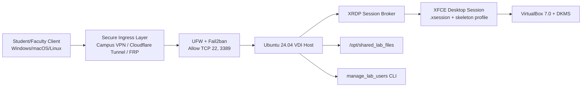

# Automated Virtual Desktop Infrastructure (VDI)
**Engineered by:** Shahied Rustin | Rustin Systems


## 📌 Impact at a Glance
This project automates the provisioning of a fresh Ubuntu 24.04 server into a secure, multi-user VDI node for student engineering labs.

## 🎯 Problem & Impact

### The problem
Many students either had no laptop or had devices that could not handle virtualization-heavy coursework (VirtualBox/KVM).  
As a result, assignment work was restricted to supervised physical labs, and students often had to wait for after-hours technician availability to finish tasks.

### What changed
This project moved the heavy compute workload from student endpoints to a centralized Ubuntu VDI host.

Students can now:
- Use low-spec personal laptops or 24/7 library/IT center PCs
- Connect remotely to a standardized lab desktop
- Continue assignments outside class hours without needing physical lab supervision

### Outcome
- Improved access equity for students without high-end hardware
- Extended practical lab availability beyond class schedules
- Repeatable Ansible-based deployment, standardized student desktop image, and CLI-driven account management.

### Performance & Scope
- Typical deployment time: **~10–15 minutes on lab-grade hardware** (time varies by network/package mirror speed and host specs).
- Lab-tested pattern: multi-user concurrent remote sessions for teaching/lab environments.

---

## 🧭 Architecture at a Glance



---

## ⚙️ Project Overview
This repository contains the Infrastructure-as-Code (IaC) required to provision a bare-metal Linux server into a secure, multi-user Virtual Desktop Infrastructure (VDI).

Originally architected for concurrent engineering students requiring remote access to virtualization workloads, this deployment bridges lightweight client machines to enterprise-grade host performance.

The deployment is automated via Ansible, converting a fresh Ubuntu Server installation into an XFCE desktop environment with controlled XRDP ingress and baseline hardening.

---

## 🔧 Key Engineering Features
- **Idempotent Provisioning:** Ansible playbooks manage repository setup, package installation, and baseline configuration.
- **Kernel Baseline Control:** Supports pinned/stable kernel strategy for VirtualBox compatibility (maintainer-adjustable).
- **Standardized Student Desktop Image:** Uses `/etc/skel` to clone a controlled default environment for new users.
- **XRDP Session Stabilization:** `.xsession` defaults improve consistency across remote desktop logins.
- **Security Hardening:** UFW + Fail2ban baseline with restricted ingress.
- **CLI User Lifecycle Management:** `manage_lab_users` script for onboarding/offboarding and group assignment.

---

## ⚠️ Compatibility & Maintenance Notice
This deployment is engineered and tested for **Ubuntu 24.04 LTS**.

- Kernel and VirtualBox compatibility can change over time.
- If Canonical/Oracle release updates that impact DKMS modules or package names, playbook variables/tasks may require maintenance.
- Review and test in a sandbox before production rollout.

---

## 🚀 Setup & Deployment

### Prerequisites
1. Physical server or VM with fresh **Ubuntu Server 24.04**.
2. Admin account with `sudo` and OpenSSH enabled.
3. Ansible on your control node.

### Deployment Steps

1. Clone this repository:
```bash
git clone https://github.com/rustinsystems/Automated-Virtual-Desktop-Infrastructure.git
cd Automated-Virtual-Desktop-Infrastructure
```

2. Update `hosts.ini`:
```ini
[lab_servers]
node1 ansible_host=192.168.X.X ansible_user=your_admin_username
```

3. Run the playbook:
```bash
ansible-playbook -i hosts.ini setup_node.yml -K
```

If SSH password auth is enabled:
```bash
ansible-playbook -i hosts.ini setup_node.yml -k -K
```

4. Reboot target host after completion.

---

## 🛠️ Daily Operations: User Management
On the server:

```bash
sudo manage_lab_users
```

Features:
- Add user (home/profile setup, group assignment, default password flow)
- Remove user (account + home cleanup)
- List active users

---

## 🔒 Security & Ingress Posture
This platform is designed for private/internal access patterns.

- Baseline host firewall: UFW deny-by-default
- Allowed inbound TCP ports: **22 (SSH)** and **3389 (XRDP)**
- Brute-force mitigation: Fail2ban (`sshd` jail)
- Recommended ingress: **Campus VPN, Cloudflare Tunnel, or FRP**
- **Not recommended:** direct internet exposure of RDP on public edge

---

## 🧪 Support / Limitations
- Not intended for internet-exposed RDP without additional controls.
- Tested on Ubuntu 24.04 LTS baseline.
- Assumes SSH + XRDP ports are reachable from trusted network overlays.
- VirtualBox/kernel compatibility may require periodic updates.
- Troubleshooting and enterprise ingress patterns: see `ARCHITECTURE.md` and `Quick Start Guide.md`.

---

## 📚 Extended Documentation
- [📖 Quick Start Guide](https://github.com/rustinsystems/Automated-Virtual-Desktop-Infrastructure/blob/main/docs/Quick%20Start%20Guide.md)
- [ARCHITECTURE](https://github.com/rustinsystems/Automated-Virtual-Desktop-Infrastructure/blob/main/docs/ARCHITECTURE.md)

---

## 📄 License
This project is licensed under the MIT License - see the [LICENSE](https://github.com/rustinsystems/Automated-Virtual-Desktop-Infrastructure/blob/main/LICENSE) file for details.
